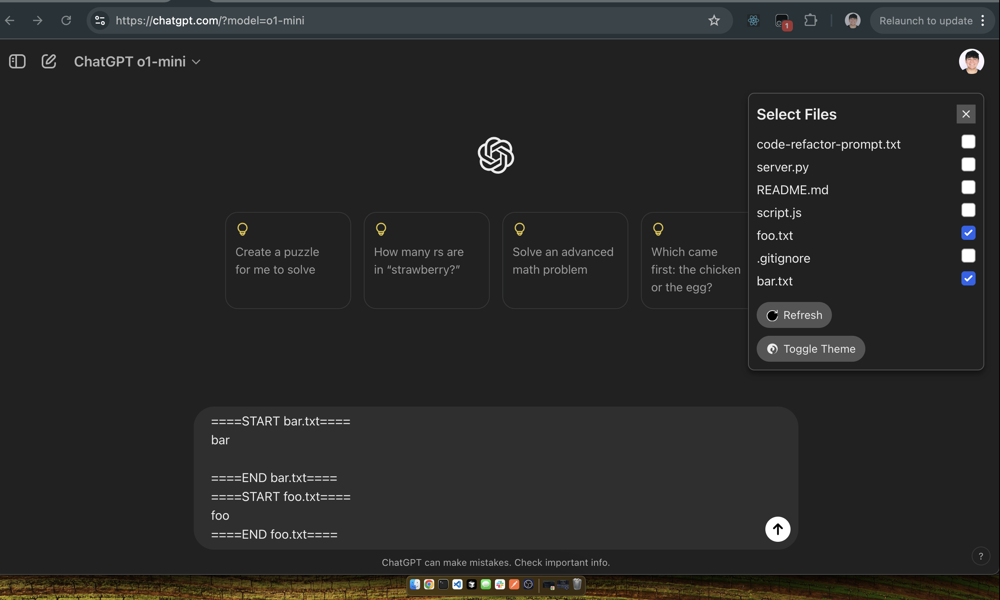

# ChatGPT Extension for code file context
Easily get paste your code files and save some time

Screenshot


Current features:
Reads directory for code files
Refresh to fetch updated files
Select and unselect to add or remove files in text box

Future features:
- Allow diff view of suggested changes within the chatgpt response
- Apply code changes to specified file


# Setup
Run the backend

```
python3 -m venv venv
source venv/bin/activate
pip install --upgrade pip
pip install -r requirements.txt
```

